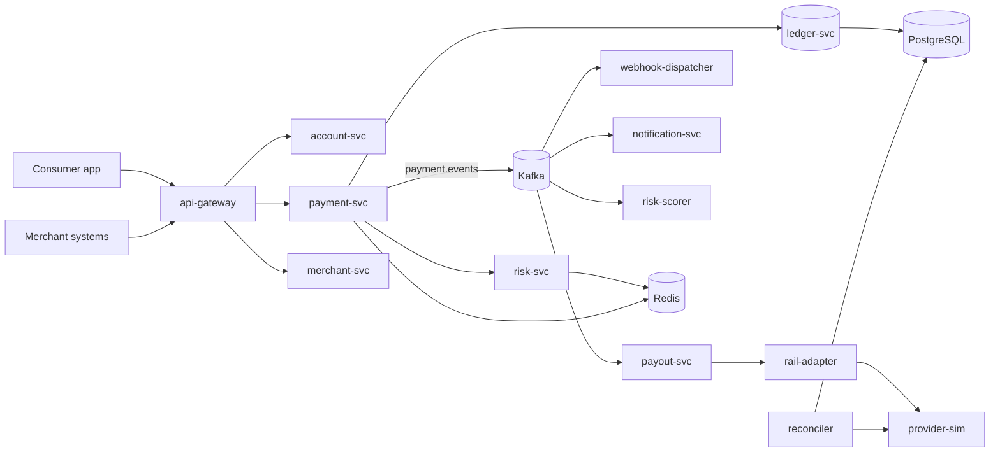

# Architecture

Marspay is a digital wallet. Consumers hold a balance, pay merchants, and settle bills.
Merchants accept payments and get paid out. The platform keeps a double-entry ledger that
must never lose or invent money.

This document describes the system as designed. Sections marked **planned** are not built
yet. Nothing here claims to be running in production.

## 1. The one thing that makes this different

Every major Indonesian wallet pays merchants on a T+1 or T+2 batch. Marspay pays them
**within seconds of the customer tapping pay**, and manages the resulting risk with a
per-merchant holdback percentage recomputed every five minutes.

This is not a marketing line. It forces three subsystems that would otherwise not exist:

| Subsystem | Exists because of instant payout |
|---|---|
| Merchant risk scoring | something has to decide the holdback rate |
| Platform float management | we pay out before funds are collected, so we lend our own money |
| Payout engine with rail selection | a nightly batch job becomes a latency-bound streaming system |

The constraint that keeps it honest: **float is finite**. When platform float crosses 85%
of its limit, instant payout degrades to batch automatically. It degrades, it does not fail.

## 2. Service map



| Service | Responsibility | Stores |
|---|---|---|
| `api-gateway` | auth, rate limiting, request routing | Redis |
| `account-svc` | users, KYC tier, limits, devices | Postgres |
| `payment-svc` | payment orchestration, idempotency, holds | Redis + Postgres |
| `ledger-svc` | double-entry posting, balance projection | Postgres |
| `merchant-svc` | merchants, outlets, cashiers, API keys | Postgres |
| `risk-svc` | synchronous velocity checks on the hot path | Redis |
| `risk-scorer` | asynchronous merchant scoring, holdback rate | Postgres + Redis |
| `payout-svc` | instant payout, float enforcement, rail selection | Postgres + Redis |
| `rail-adapter` | one interface per bank rail (BI-FAST, internal, SKNBI) | — |
| `webhook-dispatcher` | at-least-once delivery, retry, DLQ | Postgres |
| `notification-svc` | push and inbox fan-out | Postgres |
| `reconciler` | daily internal ledger vs provider statement | Postgres |
| `provider-sim` | fake banks, QRIS switch, billers, with fault injection | — |

## 3. Consistency models are deliberately different per service

This is the core design decision of the system, and the one most worth defending.

| Subsystem | Model | Why it is allowed to be this weak, or must be this strong |
|---|---|---|
| Ledger | strict serializable | money must never be lost or invented; one Postgres transaction per posting |
| Balance cache | eventually consistent | it is a projection; when cache and ledger disagree, the ledger wins |
| Velocity / risk check | best effort, bounded staleness | a counter that is 200 ms stale is fine; a check that adds 200 ms is not |
| Payment status | sequential per payment | a state machine, never a naive `UPDATE`; late and duplicate callbacks are normal |
| Webhook delivery | at-least-once | exactly-once across a network boundary does not exist; receivers must be idempotent |
| Merchant holdback rate | eventually consistent, 5 min | a slightly stale rate costs basis points, not correctness |

The single invariant everything else protects:

```sql
SELECT SUM(amount_minor) FROM ledger_entries;  -- must always be exactly 0
```

Balances are **not** a column. A balance is the sum of an account's ledger entries. The
cached value in Redis is a read optimisation and is always reconstructable from Postgres.

## 4. Hot path and slow path

Two paths with different budgets. Nothing on the hot path touches disk.

```
HOT   POST /v1/payments
      gateway auth (Redis)      3 ms
      velocity check (Redis)    5 ms
      balance hold (Redis Lua)  4 ms
      ledger commit (Postgres) 25 ms
      publish to Kafka          3 ms
      ----------------------------- p99 target < 120 ms

SLOW  payment.events consumers
      payout, webhook, notification, risk scoring
      ----------------------------- seconds, and that is fine
```

The payout SLA is 10 seconds from payment to money landing in the merchant's bank account.
Measured breakdown of a typical 6.2 s p95:

| Stage | Time | Under our control |
|---|---|---|
| risk scoring + holdback | 41 ms | yes |
| ledger posting | 28 ms | yes |
| Kafka queue to worker pickup | 180 ms | yes |
| bank rail call (BI-FAST) | 5 900 ms | **no** |

95% of the latency lives in the bank rail. Optimising our own code cannot move this number.
What moves it is choosing the right rail per destination bank and failing over when one rail
slows down. This is why `rail-adapter` is a separate component with per-rail health metrics
rather than a single HTTP client.

## 5. A payment, end to end

1. Client sends `POST /v1/payments` with an `Idempotency-Key`.
2. Gateway authenticates and rate limits in Redis.
3. `payment-svc` checks the key. A replay returns the original response, never a second payment.
4. `risk-svc` runs velocity counters in Redis. Over threshold means decline or step-up.
5. Balance is held atomically in Redis via a Lua script (check and decrement in one round trip).
6. `ledger-svc` posts the entries in one Postgres transaction: debit payer, credit merchant
   payable, credit platform fee. The three sum to zero.
7. `payment.succeeded` is published to Kafka, partitioned by `merchant_id`.
8. Consumers proceed independently and at their own pace:
   - `payout-svc` computes holdback, checks float, selects a rail, sends the payout
   - `webhook-dispatcher` delivers to the merchant with retry and DLQ
   - `notification-svc` writes to the user inbox and sends push
   - `risk-scorer` updates the merchant's rolling score

If step 8 partially fails, step 6 still stands. Money is correct; notification is late. That
ordering is intentional and is the reason the ledger is written before anything is published.

## 6. Kafka topics

| Topic | Key | Partitions | Retention | Consumers |
|---|---|---|---|---|
| `payment.attempts` | `user_id` | 6 | 24 h | risk-scorer |
| `payment.events` | `merchant_id` | 12 | 7 d | payout, webhook, notification, risk-scorer |
| `ledger.entries` | `account_id` | 12 | 7 d | balance projector, reconciler |
| `payout.events` | `merchant_id` | 6 | 7 d | webhook, float tracker |
| `webhook.deliveries` | `merchant_id` | 6 | 3 d | webhook-dispatcher |
| `webhook.dlq` | `merchant_id` | 3 | 30 d | manual replay only |

Keying by `merchant_id` gives per-merchant ordering without locks. It also creates the hot
partition problem when one merchant dominates volume; the mitigation is a composite key
`merchant_id:shard_n` for merchants above a volume threshold.

## 7. Payment rails are simulated, on purpose

Moving real money in Indonesia requires a PJP licence from Bank Indonesia. BI-FAST and the
QRIS switch have no sandbox for individuals. That is a hard stop, not a shortcut we took.

`provider-sim` replaces them, and is more useful than a real sandbox would be. Real sandboxes
always succeed, always respond quickly, and always deliver their callbacks, so the interesting
code paths never execute. The simulator is configured to misbehave:

```yaml
bifast:
  latency: { p50: 3s, p99: 11s }
  outcomes:
    success: 0.97
    rejected_inactive_account: 0.02
    slow_rail: 0.01
pln:
  latency: { p50: 180ms, p99: 8s }
  outcomes:
    success: 0.92
    timeout_but_succeeded: 0.03
    callback_lost: 0.02
    callback_duplicate: 0.03
```

Two of these are the reason whole subsystems exist:

- **`callback_lost`** is the only thing that makes the reconciler meaningful. Without it the
  discrepancy table is always empty and we never learn whether the code works.
- **`timeout_but_succeeded`** is the worst case in payments: the request timed out but the
  money may have moved. Guessing "failed" double-charges on retry; guessing "succeeded" loses
  money. The only correct answer is to not guess: enter `pending` and query status until certain.

## 8. High availability

| Component | Topology | Failure behaviour |
|---|---|---|
| PostgreSQL | primary + 2 standbys, Patroni, `synchronous_commit=on` | automatic failover; committed ledger entries survive |
| Kafka | 3 brokers KRaft, RF=3, `min.insync.replicas=2` | one broker loss is transparent |
| Redis | Sentinel, 3 nodes | cache loss is recoverable; balances rebuild from the ledger |
| Stateless services | N replicas behind the gateway | rolling restart, no session affinity |

Redis is explicitly allowed to be lost. Nothing is stored there that cannot be rebuilt from
Postgres. This is a design constraint on every feature: if a feature needs Redis to be
durable, the feature is designed wrong.

## 9. Failure modes worth naming

| Failure | Effect | Response |
|---|---|---|
| Redis down | hot path unavailable | fail closed, do not process payments blind |
| Postgres primary down | writes pause | Patroni failover, payments resume |
| Kafka lag climbing | payouts and webhooks fall behind | payment still correct; scale consumers |
| Provider callback lost | ledger and provider disagree | reconciler flags it next run |
| Float above 85% | too much of our money is out | instant payout degrades to batch automatically |
| Merchant fraud | payout already sent, holdback insufficient | platform absorbs the loss; this is the real cost of the differentiator |

## 10. Deliberately out of scope

Paylater and credit, investments, insurance, multi-currency, cross-border, a machine-learning
fraud model, and real bank integration. Each of these adds surface area without adding a new
distributed systems problem. The holdback formula stays deliberately explainable:

```
expected_loss = dispute_rate * 0.25 + refund_rate * 0.02 + age_penalty
holdback      = clamp(1.5%, 45%, expected_loss * 200)
```

A merchant is entitled to know why their money is being held. A model that cannot explain
itself is not acceptable here, regardless of how much better it might score.

Calibration points, pinned by tests in `internal/risk`:

| Merchant | Holdback |
|---|---|
| 4 years old, 0.08% refunds, no disputes | 1.5% (floor) |
| 6 months old, 0.31% refunds, no disputes | 3.24% |
| 1 month old, clean record | 8% |
| 4 months old, 4% refunds, 0.4% disputes | 38% |
| 11 days old, 18.9% refunds, 9% disputes | 45% (ceiling) |

The weights exist because the first calibration was wrong: with a dispute weight of 0.8 almost
every merchant with any dispute history saturated at the 45% ceiling, which made the whole
holdback dimension decorative. `TestMidRangeIsReachable` now fails if the curve saturates that
fast again. Illustrative numbers in `mockup/` predate this calibration and will be reconciled
when the front end is rebuilt.
